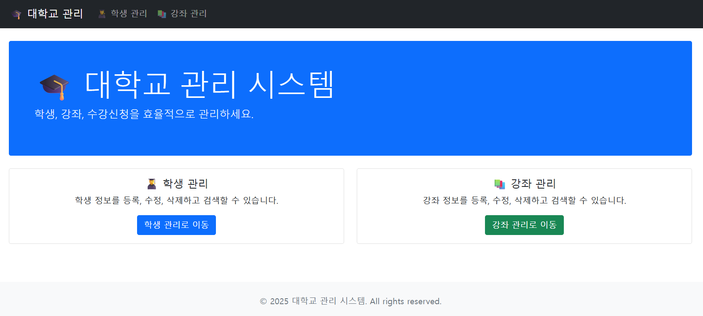

# 🎓 Student Course Management System

> A simple CRUD web application for managing students, courses, and enrollments built with Java Spring MVC

[](https://www.oracle.com/java/)
[](https://gradle.org/)
[](https://www.mysql.com/)
[](LICENSE)

## 📸 Demo


*University Management System - Clean and intuitive interface for managing students and courses*

## ✨ Features

- 👥 **Student Management** - Create, read, update, delete student records
- 📚 **Course Management** - Manage course information and details  
- 📝 **Enrollment System** - Handle student course registrations
- 🔍 **Search & Pagination** - Find students/courses with pagination support
- 📱 **Responsive Design** - Works on desktop and mobile devices

## 🛠 Tech Stack

**Backend:**
- Java 17
- Spring MVC (Servlet-based)
- MyBatis
- MySQL 8.0
- HikariCP (Connection Pooling)

**Frontend:**
- JSP
- JSTL
- Bootstrap (via WebJars)
- jQuery

**Build & Deploy:**
- Gradle
- Apache Tomcat 9+

## 🚀 Quick Start

```bash
# Clone the repository
git clone https://github.com/prisma77/Crud.git
cd Crud

# Build the project
./gradlew war

# Deploy to Tomcat
cp build/libs/crud.war $TOMCAT_HOME/webapps/
```

## 📋 Prerequisites

- Java 17 or higher
- MySQL 8.0 or higher
- Apache Tomcat 9.0 or higher
- Gradle (included wrapper)

## ⚙️ Installation

### 1. Database Setup

Create database and user:

```sql
CREATE DATABASE orange DEFAULT CHARACTER SET utf8mb4 COLLATE utf8mb4_unicode_ci;
CREATE USER 'prisma'@'localhost' IDENTIFIED BY '1234';
GRANT ALL PRIVILEGES ON orange.* TO 'prisma'@'localhost';
FLUSH PRIVILEGES;
```

Run schema and sample data:

```bash
mysql -u prisma -p orange < schema.sql
mysql -u prisma -p orange < data.sql
```

### 2. Configuration

Update database connection in `src/main/resources/config/database.properties`:

```properties
jdbc.url=jdbc:mysql://localhost:3306/orange?serverTimezone=Asia/Seoul&useUnicode=true&characterEncoding=utf8&useSSL=false&allowPublicKeyRetrieval=true
jdbc.username=your_username
jdbc.password=your_password
```

### 3. Build & Deploy

```bash
# Build WAR file
./gradlew clean war

# Deploy to Tomcat
cp build/libs/crud.war $TOMCAT_HOME/webapps/

# Start Tomcat
$TOMCAT_HOME/bin/startup.sh
```

### 4. Access Application

Open your browser and navigate to:
```
http://localhost:8080/crud
```

## 📚 API Endpoints

### Students
| Method | Endpoint | Description |
|--------|----------|-------------|
| `GET` | `/students` | List all students |
| `GET` | `/students/{id}` | Get student details |
| `GET` | `/students/new` | New student form |
| `POST` | `/students` | Create student |
| `GET` | `/students/{id}/edit` | Edit student form |
| `POST` | `/students/{id}` | Update student |
| `POST` | `/students/{id}/delete` | Delete student |

### Courses
| Method | Endpoint | Description |
|--------|----------|-------------|
| `GET` | `/courses` | List all courses |
| `GET` | `/courses/{id}` | Get course details |
| `GET` | `/courses/new` | New course form |
| `POST` | `/courses` | Create course |
| `GET` | `/courses/{id}/edit` | Edit course form |
| `POST` | `/courses/{id}` | Update course |
| `POST` | `/courses/{id}/delete` | Delete course |

### Enrollments
| Method | Endpoint | Description |
|--------|----------|-------------|
| `POST` | `/enrollments/enroll` | Enroll student in course |
| `POST` | `/enrollments/cancel` | Cancel enrollment |

## 🗂 Project Structure

```
src/
├── main/
│   ├── java/com/prisma77/crud/
│   │   ├── controller/              # Web controllers
│   │   │   ├── CourseController.java
│   │   │   ├── EnrollmentController.java
│   │   │   ├── HomeController.java
│   │   │   └── StudentController.java
│   │   ├── service/                 # Business logic
│   │   │   ├── CourseService.java
│   │   │   ├── EnrollmentService.java
│   │   │   └── StudentService.java
│   │   ├── repository/              # Data access layer
│   │   │   ├── CourseRepository.java
│   │   │   ├── EnrollmentRepository.java
│   │   │   └── StudentRepository.java
│   │   ├── domain/                  # Entity classes
│   │   │   ├── Course.java
│   │   │   ├── Enrollment.java
│   │   │   └── Student.java
│   │   ├── config/                  # Configuration
│   │   │   ├── DatabaseConfig.java
│   │   │   └── EncodingFilter.java
│   │   ├── util/                    # Utilities
│   │   │   └── PageInfo.java
│   │   └── HelloServlet.java        # Sample servlet
│   ├── resources/
│   │   ├── config/                  # Configuration files
│   │   │   ├── database.properties
│   │   │   └── mybatis-config.xml
│   │   └── logback.xml              # Logging config
│   └── webapp/
│       ├── WEB-INF/
│       │   ├── views/               # JSP templates
│       │   │   ├── common/          # Common templates
│       │   │   │   ├── footer.jsp
│       │   │   │   ├── header.jsp
│       │   │   │   └── nav.jsp
│       │   │   ├── course/          # Course pages
│       │   │   │   ├── detail.jsp
│       │   │   │   ├── form.jsp
│       │   │   │   └── list.jsp
│       │   │   ├── student/         # Student pages
│       │   │   │   ├── detail.jsp
│       │   │   │   ├── form.jsp
│       │   │   │   └── list.jsp
│       │   │   ├── error/           # Error pages
│       │   │   │   ├── 404.jsp
│       │   │   │   ├── 500.jsp
│       │   │   │   └── error.jsp
│       │   │   └── home.jsp         # Home page
│       │   └── web.xml              # Web configuration
│       └── index.jsp                # Welcome page

```

## 🤝 Contributing

1. Fork the repository
2. Create your feature branch (`git checkout -b feature/amazing-feature`)
3. Commit your changes (`git commit -m 'Add some amazing feature'`)
4. Push to the branch (`git push origin feature/amazing-feature`)
5. Open a Pull Request

## 📝 License

This project is licensed under the MIT License - see the [LICENSE](LICENSE) file for details.

## 👨‍💻 Author

**prisma77**
- GitHub: [@prisma77](https://github.com/prisma77)

---

⭐ Star this repository if you found it helpful!

